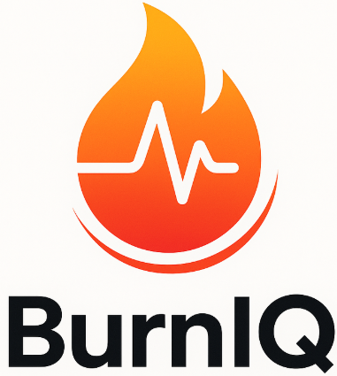
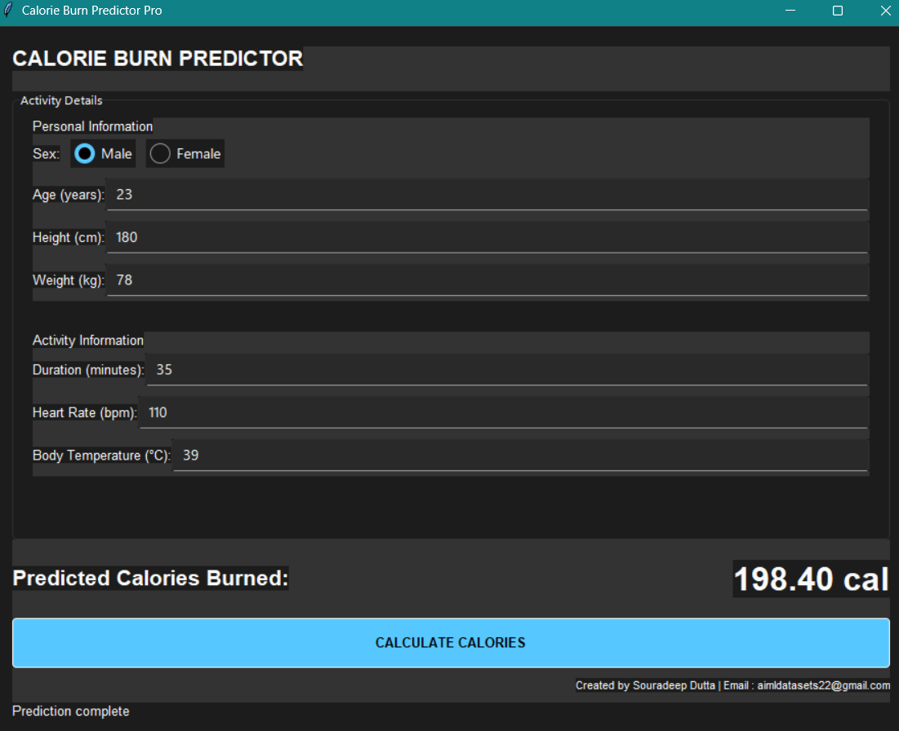

# **🔥 Calories Burnt Prediction: Local ML Model Deployment & GUI App: BurnIQ 🏃‍♀️**

This repository contains a PyTorch-based neural network model and an accompanying app (.exe, bundled with instructions for deploying the ML model) designed to predict the calories burned by an individual during a workout session. The project encompasses data preprocessing, model development, training, testing, and generating an .exe app for this model. The model achieved a whopping 0.9915 R² score (closer to 1, the better) in real life scenarios.

<video controls width="640" height="360">
    <source src="App_vid.mp4" type="video/mp4">
</video>
A small demonstration of it's implementation in a local environment (.exe file execution showcased here).

## **📝 Table of Contents**

* [Project Overview](#bookmark=id.lni3spuc9vw1)  
* [Features](#bookmark=id.mwtkbhijzfkm)  
* [Dataset](#bookmark=id.)
* [Installation](#bookmark=id.nw9xsq1gwgr1)  
* [Usage](#bookmark=id.qzfg37dt8fgo)  
* [Model Architecture](#bookmark=id.1pal5el0ct0w)  
* [Training](#bookmark=id.ecy7jk46rqz9)  
* [Results & Visuals](#bookmark=id.ulsol57la4t3)  
* [Contributing](#bookmark=id.wdp3eljxbi4l)  
* [License](#bookmark=id.3gffwmfltxo9)  
* [Contact](#bookmark=id.21r3n1a1eib8)

## **🚀 Project Overview**

The primary goal of this project is to accurately predict the calories burnt by an individual during a workout session. This can be beneficial for fitness tracking applications, personalized health recommendations, and understanding the energy expenditure associated with different activities.

Beyond the core model, this project also includes a **Graphical User Interface (GUI) application** built with tkinter and sv\_ttk, allowing users to interactively input their details and get real-time calorie predictions. The application can be packaged into a standalone executable for easy distribution and use.

The Best\_predict-calorie.ipynb Jupyter notebook provides a comprehensive solution, demonstrating:

* Robust data loading and preprocessing using pandas and numpy.  
* Feature scaling using StandardScaler to normalize numerical features.  
* A custom deep neural network (nn.Module) built with PyTorch for regression.  
* A structured training loop with Adam optimizer and MSELoss.  
* Learning rate scheduling with ReduceLROnPlateau for adaptive optimization.  
* Early stopping mechanism to prevent overfitting and optimize training duration.  
* Evaluation using the R2 Score from torcheval.metrics.  
* Generation of a submission file (Predicted\_Calories\_Burnt.csv) for competition.

The MLD\_calorie\_pred\_GUI.py script implements the interactive GUI application.

## **📊 Dataset**

The project utilizes data from the Kaggle Playground Series \- Season 5, Episode 5, focused on predicting calories burnt.

## **🛠️ Installation**

To set up and run this project, ensure you have Python installed. Using a virtual environment is highly recommended to manage dependencies.

1. **Clone the repository (if applicable):**  
   \# If this were a Git repository, you would clone it like this:  
   \# git clone \<repository\_url\>  
   \# cd calories-burnt-prediction

2. **Install dependencies:**  
   pip install numpy pandas torch torcheval tqdm scikit-learn joblib kagglehub tkinter Pillow sv\_ttk

   *Note: tkinter is usually included with Python installations. Pillow is for image handling (e.g., for logo.png).*  
3. Download the dataset:  
   The script uses kagglehub to download the competition data. You'll need to have Kaggle API credentials configured (usually kaggle.json in \~/.kaggle/). The script includes kagglehub.login() which might prompt for credentials if not already set up.  
   The relevant lines in the script for automatic download are:  
   import kagglehub  
   kagglehub.login()  

## **💡 Usage**

### **Training the Model**

To run the full pipeline (data preprocessing, training, and prediction), execute the Best\_predict-calorie.ipynb notebook in a Jupyter environment (e.g., Google Colab, Jupyter Lab) or convert it to a Python script and run it.

\# If running as a Python script (after converting .ipynb to .py)  
python Best\_predict-calorie.py

The notebook/script will perform the following actions:

1. Load train.csv and test.csv.  
2. Clean and preprocess the data (convert 'Sex', scale features).  
3. Initialize and train the neural network model.  
4. Save the best model state as Calories\_Prediction.pt.  
5. Save the X\_scaler.pkl and y\_scaler.pkl for future use.  
6. Generate Predicted\_Calories\_Burnt.csv in the current working directory.

### **Running the GUI Application**

Once you have the MLD\_calorie\_pred\_GUI.py script, Calories\_Prediction.pt, X\_scaler.pkl, and y\_scaler.pkl files in the same directory (and optionally logo.png), you can run the GUI application directly:

python MLD\_calorie\_pred\_GUI.py

This will launch the interactive calorie prediction interface.

### **Building the Executable (.exe)**

To package your GUI application into a standalone Windows executable, you can use **PyInstaller**. This bundles your Python script, its dependencies, and the Python interpreter into a single distributable file.

**1\. Project Setup & Prerequisites:**

Ensure all necessary files are in a dedicated folder, e.g., CaloriePredictorApp:

CaloriePredictorApp/  
├── MLD\_calorie\_pred\_GUI.py  
├── Calories\_Prediction.pt  
├── X\_scaler.pkl  
├── y\_scaler.pkl  
└── logo.png (if used)

**2\. Install PyInstaller:**

Open your command prompt or terminal and install PyInstaller:

pip install pyinstaller

**3\. Generate the .spec File:**

Navigate to your project directory (CaloriePredictorApp) in the command prompt. Then, run PyInstaller to generate a .spec file, which acts as a blueprint for the build process:

cd path/to/CaloriePredictorApp  
pyinstaller \--onefile \--windowed MLD\_calorie\_pred\_GUI.py

* \--onefile: Creates a single executable file.  
* \--windowed: Prevents a console window from opening when your GUI application runs.

**4\. Edit the .spec File (Crucial Step\!):**

Open the generated MLD\_calorie\_pred\_GUI.spec file in a text editor. You **must** explicitly tell PyInstaller to include your model (.pt), scaler (.pkl) files, and potentially sv\_ttk assets.

Locate the a.datas list and modify it as follows. Also, add sv\_ttk to hiddenimports.

**5\. Build the Executable:**

Save the modified .spec file, then run PyInstaller again, this time pointing to the .spec file:

pyinstaller MLD\_calorie\_pred\_GUI.spec

**6\. Test Your Executable:**

The executable will be found in the dist/ folder within your project directory (e.g., CaloriePredictorApp/dist/BurnIQ.exe). Double-click it to verify functionality.

## **📈 Results & Visuals**

During the training phase, the script provides real-time logging of training loss, validation loss, training R2 score, and validation R2 score for each epoch. The model's state with the highest validation R2 score is automatically saved as Calories\_Prediction.pt.

**Example Training Log Output:**

Epoch 1/100 | Train Loss: 0.0386 | Val Loss: 0.0151 | Train R2: 0.9614 | Val R2: 0.9875  
Epoch 2/100 | Train Loss: 0.0180 | Val Loss: 0.0085 | Train R2: 0.9820 | Val R2: 0.9915  
Epoch 4/100 | Train Loss: 0.0136 | Val Loss: 0.0107 | Train R2: 0.9864 | Val R2: 0.9801 
Epoch 6/100 | Train Loss: 0.0105 | Val Loss: 0.0125 | Train R2: 0.9895 | Val R2: 0.9800
Epoch 7/100 | Train Loss: 0.0106 | Val Loss: 0.0124 | Train R2: 0.9667 | Val R2: 0.9896

Early stopping at epoch 7\. Best Val R2: 0.9915

### **Visualizations & Sample Predictions**

Here, you would typically include images to visually represent your project's progress and capabilities.

* Our Application Icon:

* App GUI Screenshot:

## **🤝 Contributing**

We welcome and appreciate contributions to this project\! If you have suggestions for improvements, new features, or encounter any bugs, please follow these steps:

1. **Fork the repository**.  
2. Create a new branch for your feature or bug fix:  
   git checkout \-b feature/YourFeatureName  
   \# or  
   git checkout \-b bugfix/FixDescription

3. Make your changes and ensure they adhere to the project's coding style.  
4. Commit your changes with a clear and concise message:  
   git commit \-m 'feat: Add Your New Feature'  
   \# or  
   git commit \-m 'fix: Resolve Bug Description'

5. Push your changes to your forked repository:  
   git push origin feature/YourFeatureName

6. Open a Pull Request to the main branch of this repository, describing your changes in detail.

## **📜 License**

This project is open-source and available under the MIT License, attached in the repo.

## **📧 Contact**

For any questions, feedback, or inquiries, please feel free to reach out:

* **Name**: Souradeep Dutta  
* **Email**: aimldatasets22@gmail.com  
* **GitHub Profile**: [https://github.com/Souradeep2233](https://github.com/Souradeep2233)